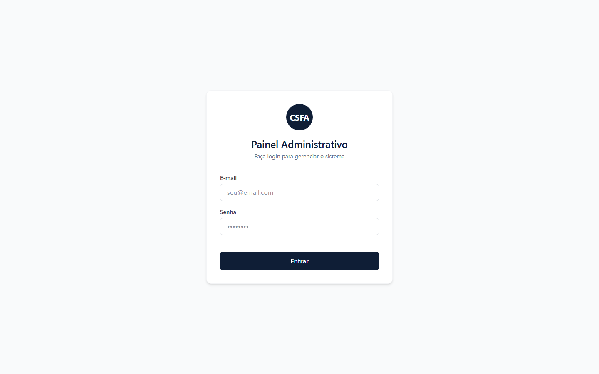
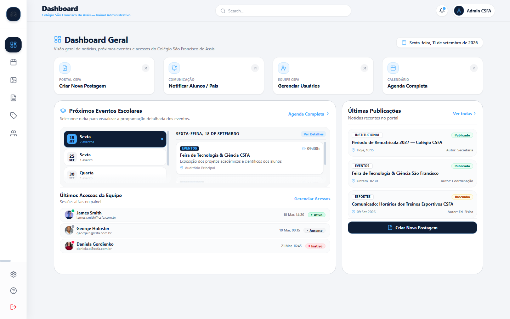
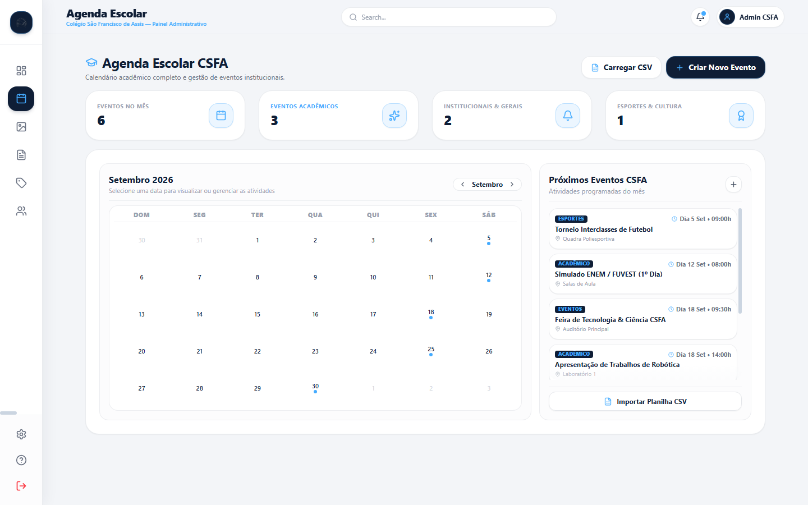
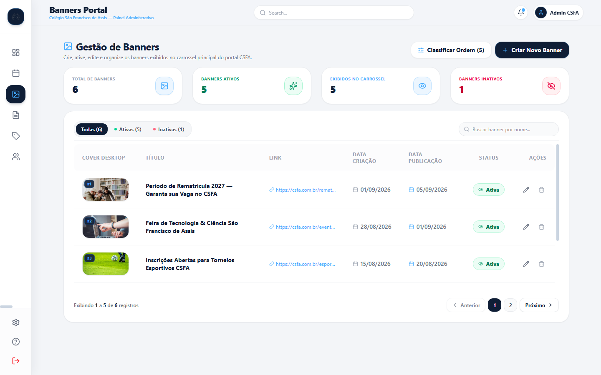
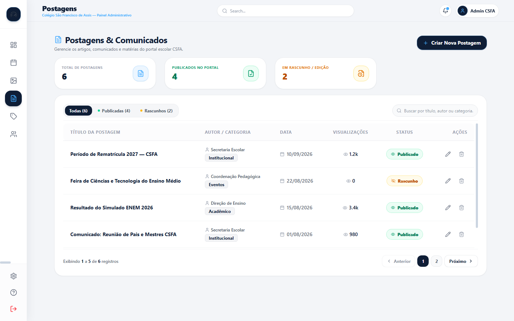
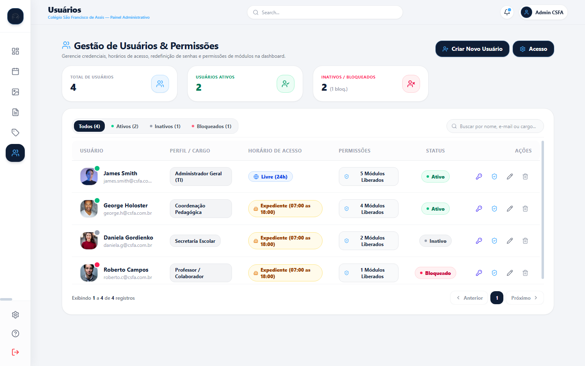

# App CMS CSFA (Painel Administrativo)


<br>

> Frontend SPA, foi projetado para ser o repsonsavel ser o centro administrativo do site do Colégio São Francisco de Assis.Permite a gestão estruturada de informações e conteúdos, de forma simples e dinamica.

### 📌 Resumo Executivo

O CMS foi construído sob um rigoroso Design System visual utilizando **Tailwind CSS v4** e **React 19**. Focado na Developer Experience (DX), apresenta uma arquitetura componentizada por features (Feature-Sliced Design simplificado) e contratos estritos de comunicação assíncrona.

> [!NOTE]
> Este projeto depende estritamente da API CSFA. As configurações do Axios no frontend devem apontar para a porta do backend local.

<details>
<summary>🛠️ Diferenciais de Implementação (Clique para expandir)</summary>

- **Autoria de Microcomponentes:** Elementos isolados abstraem lógicas de estilo (sem vazar Tailwind para consumo), garantindo 100% de consistência visual.
- **Padrão Container/Presentational:** Telas lidam com mutações HTTP, componentes isolados apenas renderizam (Single Responsibility Principle).
- **Tipagem Dinâmica:** Todo form-data é previamente validado com `zod` (`Safe Parse Pattern`), barrando payloads inválidos de saírem do client.
</details>

<details>
<summary>📂 Estrutura Arquitetural</summary>

```text
src/
├── assets/          # Tokens visuais e recursos estáticos
├── components/      # (Design System) Componentes base reutilizáveis (ui/)
├── features/        # Módulos de domínio de negócio (Ex: posts/, users/)
├── lib/             # Instâncias configuradas de bibliotecas (Axios interceptors)
├── pages/           # Entradas do React Router (Views)
└── routes/          # Definições de rotas protegidas e hierarquia
```
</details>

## 📸 Demonstração (UI & Prints)

<div align="center">
  
  
  <br>
  
  
  <br>
  
  

</div>

## 💻 Pré-requisitos

Antes de começar, verifique se você atendeu aos seguintes requisitos:

- Ter o `<Node.js>` (Preferencialmente LTS) instalado.
- Ter o backend (`api-csfa`) clonado, rodando localmente, e sua URL disponível.
- Seu editor configurado para suportar `TypeScript` e Linting.

## 🚀 Instalando o App CMS CSFA

Para configurar o painel administrativo na sua máquina local:

```bash
git clone https://github.com/Cloves-Neto/app-cms-csfa.git
cd app-cms-csfa
npm install
```

Crie um arquivo de configuração de ambiente (`.env`) na raiz do projeto com as seguintes variáveis:

```env
# URL base para chamadas gerais à API
VITE_API_BASE_URL=http://localhost:8080

# URL específica (útil caso haja versionamento, ex: /v1)
VITE_API_URL=http://localhost:8080

# Tempo máximo de espera para requisições (em milissegundos)
VITE_API_TIMEOUT=15000

# Nome da chave onde o token JWT será salvo no Storage do navegador
VITE_TOKEN_STORAGE_KEY=token
```

<details>
<summary>📋 Entendendo as Variáveis e Como Configurar</summary>

- **`VITE_API_BASE_URL` & `VITE_API_URL`**: Indicam o endereço do backend. Se estiver rodando o servidor localmente na porta 8080, mantenha o valor padrão. Caso faça o deploy do backend, substitua pelo domínio de produção.
- **`VITE_API_TIMEOUT`**: Define o limite de tolerância (timeout) nas requisições feitas pelo Axios. No exemplo acima, o frontend aguardará 15 segundos (15000ms) antes de abortar a chamada.
- **`VITE_TOKEN_STORAGE_KEY`**: Chave utilizada internamente pela aplicação para gravar/ler a sessão do usuário logado no `localStorage`.
</details>

## ☕ Usando o App CMS CSFA

O ambiente de desenvolvimento é impulsionado pelo **Vite**, entregando Hot Module Replacement ultra-rápido.

```bash
npm run dev
```

> [!TIP]
> A interface administrativa estará rodando geralmente na porta 5173. Abra `http://localhost:5173` em seu navegador.

Para validação completa de Build e Typescript (Pipeline check), você pode usar:
```bash
npm run build && npm run preview
```

---

## 🔄 Atualizações e Roadmap

**Versão Atual:** `1.0.0-beta`

> [!TIP]
> Este projeto está em desenvolvimento ativo. Confira as implementações em andamento abaixo.

### 🚧 Próximas Features (Em Progresso)
- [ ] Sistema de notificações em tempo real.

---

## 👨‍💻 Desenvolvedor

<a href="https://github.com/Cloves-Neto">
 
</a>

**Cloves Neto**

[](https://devneto.com.br)<br>
[](mailto:cvr.neto20@gmail.com)<br>
[967338685-25D366?style=for-the-badge&logo=whatsapp&logoColor=white)](https://wa.me/5511967338685)

